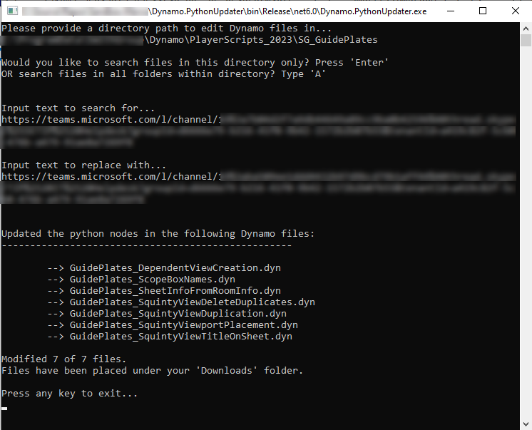

# Dynamo.PythonUpdater

A .NET6 Console app tool to scrape Dynamo files within a folder.
Finds and replaces Python code within files if any and outputs modified files to a local folder.
 

## Usage
- Clone repository and build solution.
- Run .exe in project bin.